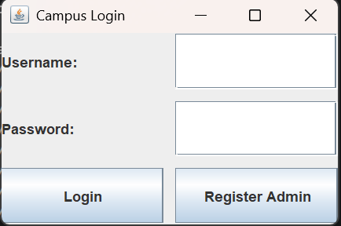
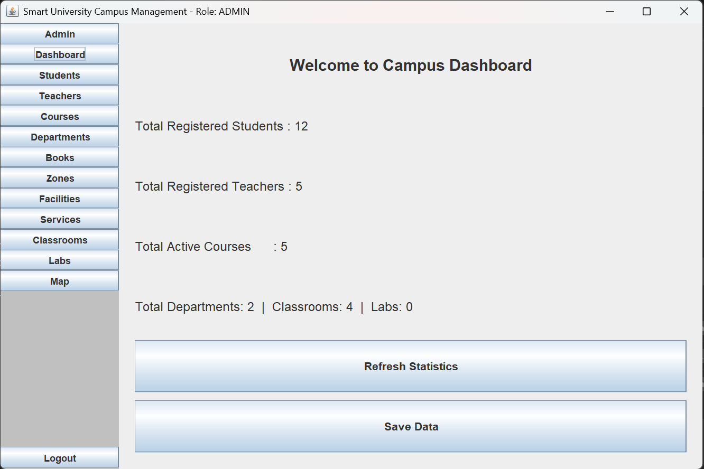
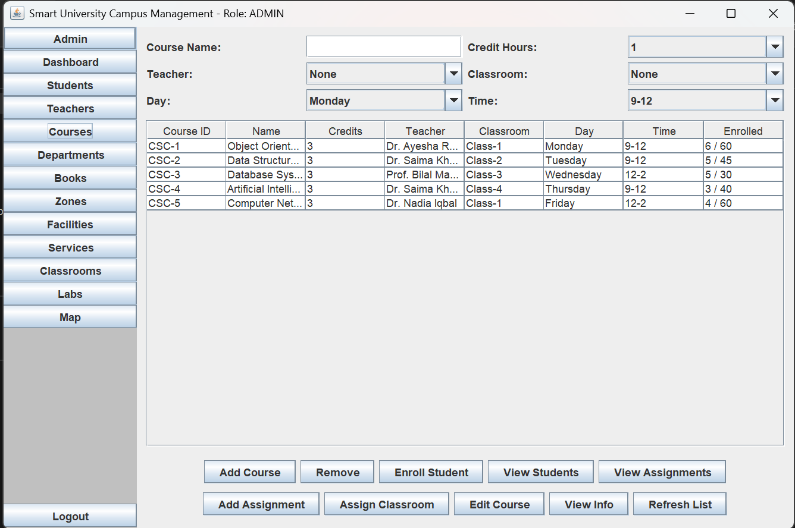
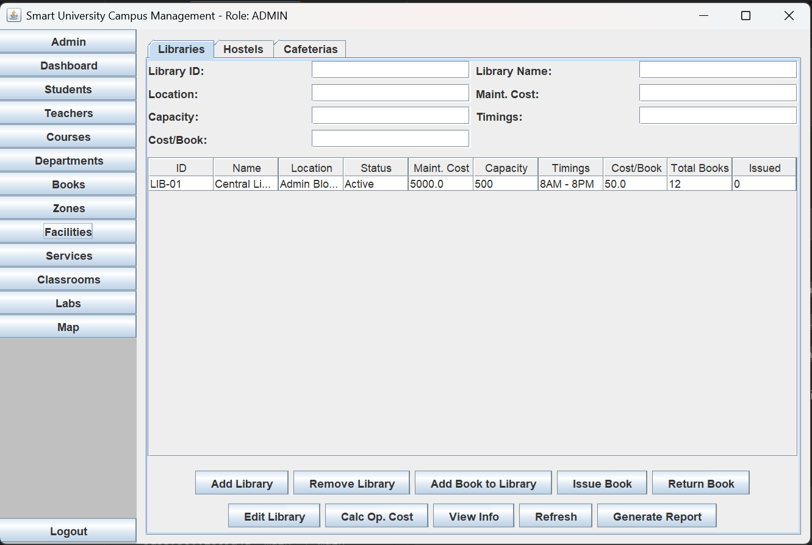

# University Campus Management System

<div align="center">


A full-featured, role-based **University Campus Management System** built in Java with a Swing GUI, demonstrating core Object-Oriented Programming principles including inheritance, abstraction, polymorphism, encapsulation, generics, and interfaces.

</div>

---

## 📋 Table of Contents

- [Overview](#-overview)
- [Features](#-features)
- [OOP Concepts Demonstrated](#-oop-concepts-demonstrated)
- [Project Architecture](#-project-architecture)
- [Class Hierarchy](#-class-hierarchy)
- [Getting Started](#-getting-started)
- [Usage](#-usage)
- [Data Persistence](#-data-persistence)
- [Screenshots](#-screenshots)

---

## 🌐 Overview

The University Campus Management System is a desktop application designed to manage all core operations of a university campus. It provides a centralized platform where administrators, teachers, and students can interact with the campus data through a clean, role-based graphical interface.

The project was built as a semester-long OOP lab project at **COMSATS University** to practically demonstrate the pillars of object-oriented design in a real-world scenario.

---

## ✨ Features

### 👤 Role-Based Access Control
Three distinct roles with tailored dashboards and permissions:
| Role | Capabilities |
|------|-------------|
| **Admin** | Full access — manage all entities, view reports, assign resources |
| **Teacher** | Manage courses, assignments, enrolled students, view department info |
| **Student** | View enrolled courses, assignments, marks, and campus facilities |

### 🏛️ Academic Management
- **Departments** — Create and manage university departments with assigned HODs
- **Courses** — Enroll students, assign teachers, track progress
- **Classrooms** — Track capacity, equipment inventory, and availability
- **Labs** — Manage computer/science labs and their equipment
- **Assignments** — Create, submit, and grade student assignments

### 🏢 Facility Management
- **Library** — Add books, issue/return books, track issued records, cost calculation
- **Hostel** — Manage rooms, occupancy, and per-room operational costs
- **Cafeteria** — Manage staff, menu items, track service orders

### 🛠️ Service Unit Management
- **Health Center** — Track doctors, medical services and operational details
- **Security Service** — Manage guards and patrol coverage
- **Transport Service** — Manage routes, drivers, and vehicle fleet

### 💾 Data Persistence
- All data is automatically saved using **Java Object Serialization**
- Auto-save runs every 5 minutes in a background daemon thread
- Static ID counters persist across sessions — IDs never repeat or reset

---

## 🧩 OOP Concepts Demonstrated

| Concept | Where Used |
|---------|-----------|
| **Inheritance** | `Campus_Entity` → `Facility` → `Library`, `Hostel`, `Cafeteria` |
| **Abstraction** | `Campus_Entity` and all base classes are `abstract` with abstract methods like `calculateOperationalCost()` |
| **Polymorphism** | All campus entities are stored as `Campus_Entity` references and their cost/display methods resolve at runtime |
| **Encapsulation** | All fields are `private` with validated getters/setters across every class |
| **Generics** | `CampusRepository<T>` is a type-safe, reusable data store used by every entity in the system |
| **Interfaces** | `Notifiable`, `Schedulable`, and `Reportable` are implemented where appropriate |
| **Serialization** | All entity classes implement `Serializable` for file-based persistence |

---

## 📁 Project Architecture

```
University-Campus-Management-System/
│
├── src/
│   ├── Main.java                          # Application entry point
│   └── com/campus/
│       │
│       ├── frontend/                      # All GUI components (Java Swing)
│       │   ├── LoginFrame.java
│       │   ├── MainFrame.java
│       │   ├── AdminPanel.java
│       │   ├── DashboardPanel.java
│       │   ├── CoursePanel.java
│       │   ├── DepartmentPanel.java
│       │   ├── ClassroomPanel.java
│       │   ├── LabPanel.java
│       │   ├── FacilityPanel.java
│       │   ├── ServicePanel.java
│       │   ├── StudentPanel.java
│       │   ├── TeacherPanel.java
│       │   ├── BookPanel.java
│       │   ├── CampusZonePanel.java
│       │   └── CampusMapPanel.java
│       │
│       └── backend/                       # All business logic and models
│           ├── CampusRepository.java      # Generic <T> data store
│           ├── CampusZone.java            # Top-level campus container
│           ├── LoginManager.java          # Credential management
│           │
│           ├── core/                      # Abstract base classes
│           │   ├── Campus_Entity.java
│           │   ├── Academic_Unit.java
│           │   ├── Facility.java
│           │   └── ServiceUnit.java
│           │
│           ├── academicunit/              # Academic entities
│           │   ├── Department.java
│           │   ├── Course.java
│           │   ├── Classroom.java
│           │   ├── Lab.java
│           │   ├── Assignment.java
│           │   ├── Equipment.java
│           │   ├── Projector.java
│           │   ├── Computer.java
│           │   ├── AirConditioner.java
│           │   ├── Camera.java
│           │   └── Fan.java
│           │
│           ├── facility/                  # Campus facilities
│           │   ├── Library.java
│           │   ├── Hostel.java
│           │   ├── Cafeteria.java
│           │   ├── Book.java
│           │   └── IssuedRecord.java
│           │
│           ├── person/                    # User roles
│           │   ├── Admin.java
│           │   ├── Teacher.java
│           │   └── Student.java
│           │
│           ├── serviceunit/               # Campus services
│           │   ├── HealthCenter.java
│           │   ├── SecurityService.java
│           │   └── TransportService.java
│           │
│           ├── interfaces/                # Behavioral contracts
│           │   ├── Notifiable.java
│           │   ├── Schedulable.java
│           │   └── Reportable.java
│           │
│           └── fileio/                    # Data persistence
│               ├── DataManager.java
│               └── CounterManager.java
│
├── data/                                  # Serialized data files (.dat)
│
├── assets/
│   └── screenshots/                       # README screenshots
│       ├── login.png
│       ├── dashboard.png
│       ├── course_panel.png
│       └── facility_panel.png
│
├── Class Diagram.png                      # UML class diagram
├── OOP Semester Project.pdf               # Project requirements document
├── .gitignore
└── README.md
```

---

## 🌳 Class Hierarchy


```text
Campus_Entity (abstract)
│
├── Academic_Unit (abstract)
│   ├── Department
│   ├── Course
│   ├── Classroom
│   └── Lab
│
├── Facility (abstract)
│   ├── Library
│   ├── Hostel
│   └── Cafeteria
│
└── ServiceUnit (abstract)
    ├── HealthCenter
    ├── SecurityService
    └── TransportService

Person
├── Admin
├── Teacher
└── Student

Equipment
├── Projector
├── Computer
├── AirConditioner
├── Camera
└── Fan
```

---

## 🚀 Getting Started

### Prerequisites
- **Java JDK 11** or higher
- **IntelliJ IDEA** (recommended) or any Java IDE

### Installation & Running

1. **Clone the repository:**
   ```bash
   git clone https://github.com/hammadabbasiisi786-cloud/University-Campus-Management-System.git
   ```

2. **Open in IntelliJ IDEA:**
   - Go to `File` → `Open` and select the project folder.
   - IntelliJ will automatically detect the project structure.

3. **Set the Source Root:**
   - Right-click on the `src` folder → `Mark Directory as` → `Sources Root`

4. **Run the application:**
   - Navigate to `src/Main.java`
   - Right-click → `Run 'Main'`

### ▶️ Running from the Terminal

If you prefer to compile and run from the command line:

```bash
# From the project root directory

# Step 1: Compile all Java source files
javac -d out src/Main.java src/com/campus/frontend/*.java src/com/campus/backend/**/*.java src/com/campus/backend/*.java

# Step 2: Run the application
java -cp out Main
```

---

## 🖥️ Usage

On first launch, a default **Admin** account is pre-loaded:

| Field | Value |
|-------|-------|
| Username | `Hamad` |
| Password | `123456` |

From the Admin dashboard, you can create Teachers and Students, who can then log in with the credentials you set for them.

---

## 💾 Data Persistence

All data is stored locally in the `data/` directory as binary serialized `.dat` files. A fresh `data/` folder is automatically created on first run if it doesn't exist.

| File | Contents |
|------|----------|
| `students.dat` | All student records |
| `teachers.dat` | All teacher records |
| `departments.dat` | All department records |
| `courses.dat` | All course records |
| `classrooms.dat` | All classroom records |
| `labs.dat` | All lab records |
| `libraries.dat` | Library data and book records |
| `hostels.dat` | Hostel and room data |
| `cafeterias.dat` | Cafeteria and menu data |
| `books.dat` | Book catalogue |
| `counters.dat` | ID counters (ensures unique IDs persist across restarts) |

---

## 📸 Screenshots

### 🔐 Login Screen


---

### 🖥️ Admin Dashboard


---

### 📚 Course Panel


---

### 🏢 Facility Panel


---

## 👨‍💻 Authors

**Hamad Abbasi** — [@hammadabbasiisi786-cloud](https://github.com/hammadabbasiisi786-cloud)

**Khawaja Syed Hamdan Ahmed** — [@hamdanahmed21](https://github.com/hamdanahmed21)

---

## 📄 License

This project is licensed under the **MIT License**.
